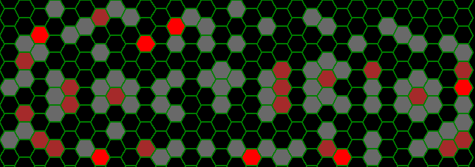

# **Bacterio** - simulating simple hypothetical protozoa biosystem

Consider a Petri dish fullfilled with some growth medium and two types of protozoa: one is supported by growth medium (later referred as _bacteria_) while the other feeds on the first one (later referred as _predators_). As far as there are plenty of medium bacteria are always well-fed unlike predators who need to hunt bacteria to survive and breed. Lucky for them bacteria are 'blind' - they don't aware of predators.

_**Disclaimer:**_ it's very unlikely that presented simulation model could be applied for any real protozoa biosystem. The main purpose of this project is to develop fluctuating but balanced non-deterministic system.  
(And yes, this is just another [Zero-player game](https://en.wikipedia.org/wiki/Zero-player_game))


## Getting started

### Prerequisites  
+ [Python 3+](https://www.python.org/downloads/) (tested with  3.6.3)  
+ [TkInter](https://docs.python.org/3/library/tkinter.html) support (you may check it running `python -m tkinter`)  

### Installing and running
Just clone (or fork) this repo, `cd` to its folder and run  
```
python -m app
```
or
```
python3 -m app
```
(if you have both Python 3+ and 2+ installed - very common case for Linux repos)

#### Running tests  
```
python -m unittest
```
With optional tests
```
BACTERIO_OPTIONAL_TESTS=1 python -m unittest
```

### Process
*Bacterio* has two processing modes - 'step-by-step' and 'play'. During 'step-by-step' mode next iteration will be calculated only if `<Space>` key is pressed. During 'play' mode iterations processed continuously after a brief delay between iterations. Pressing `<Space>` in 'play' mode switches to 'step-by-step' mode.

### Controls
`p` - enter 'play' mode (proceed step after step with a brief delay); 'play' will stop if *halt conditions* met  
`<Space>` - proceed one step (also exit 'play' mode)  
`z` or `<Mouse-1>` - place bacterium on cell under cursor  
`x` or `<Mouse-3>` - place predator on cell under cursor  
`c` or `<Mouse-2>` - clear cell under cursor  
`<Ctrl>+c` - clear the entire field  
`<Ctrl>+s` - save current state to file  
`<Ctrl>+o` - open saved state  
`<Esc>` - exit  

### Halt conditions
Currently there are two conditions which could cause 'play' mode to stop:  
+ there are no more predators left on the field;  
+ there are no more bacteria left on the field.  
Changing state (by adding or removing protozoa) always resets halt conditions.


## Model description

Field consists of hexagonal cells, each protozoan at any time occupies only one cell.  
At any given moment each bacterium has only one state parameter - its position. Each predator also described by its energy (along with position). At the beginning each predator has `PR_INIT_ENERGY`.  
Each turn all protozoa make their turns sequentially: each predator first, then each bacterium.  

#### Predator's turn  
1. If all of the following division requirements are met, predator divides with probability `P_PR_DIVIDE` - in cell it occupies there will be two predators with energy `(E-PR_DIVIDE_COST)//2` each, where `E` is current predator's energy. Newborns will not participate in current turn.  
Predator division requirements:  
  + `E >= PR_DIVIDE_ENERGY`  
  + there is less than `PR_OVERCROWD` predators within `PR_OVERCROWD_RADIUS` cells around given predator  
2. If predator is not divided and its energy is greater or equal than `PR_MAX_ENERGY` then it's considered well-fed. With probability `P_PR_STAY` it will remain still, otherwise it will move by one cell in any allowed direction. It will lose `PR_TURN_COST` in both cases.  
3. If predator is not divided and its energy is less than `PR_MAX_ENERGY` then it's considered hungry. Its energy lowers by `PR_TURN_COST`. If energy reaches zero (or below) predators dies (without moving). Otherwise it will move by one cell in the direction of closest bacterium it can find in `PR_SIGHT` radius. If it reaches one bacterium will be eaten and predator's energy increases by `PR_FEED_VALUE`. Predator can eat only one bacterium within a turn. Predator will not move if it's hungry and at least one bacterium is in the same cell with it. If there are no bacteria in `PR_SIGHT` radius, predator moves by one cell in any allowed direction.  

#### Bacterium's turn
1. If there is less than `BACT_OVERCROWD` bacteria within `BACT_OVERCROWD_RADIUS` cells around given bacterium it divides with probability `P_BACT_DIVIDE` - in cell it occupies there will be two new bacteria.
2. If bacterium is not divided it remains still with probability `P_BACT_STAY` or moves in any direction by `BACT_VELOCITY` cells. (Exactly by this value - it will not move by one cell if `BACT_VELOCITY == 2` for example.)

## Configuration

### Configuring GUI colors (palette)
Colors are loaded from [palette.ini](config/palette.ini) file. You may change them by using Tk color names (RGB like #000000 or [symbolic](https://www.tcl.tk/man/tcl8.5/TkCmd/colors.htm) names). Some palettes are stored in [palettes](config/other_palettes) directory. To use one of them replace [palette.ini](config/palette.ini).

### Configuring initial field parameters
Initial field parameters are loaded from `FIELD` category in [rules.ini](config/rules.ini) file.  
`stateFile` - forces to load initial field state from given file ignoring the rest of `FIELD` section  
`radius` - board (_Petri dish_) radius (cells)
`initBacteria` - number of bacteria should be randomly placed on field during initialization  
`initPredators` - number of predators should be randomly placed on field during initialization  

### Configuring model parameters
Model parameters are loaded from `MODEL` category in [rules.ini](config/rules.ini) file.  
The following model parameters currently supported:  
*for bacteria*  
`P_BACT_DIVIDE` - probability that bacterium will divide on two bacteria (both in the same cell) unless there are >= `BACT_OVERCROWD` bacteria in given cell  
`P_BACT_STAY` -  probability that bacterium will stand still (in case if it not divided)  
`BACT_OVERCROWD` -  number of maximum number of bacteria within BACT_OVERCROWD_RADIUS (if more or equal, bacterium will not divide)  
`BACT_OVERCROWD_RADIUS`  
`BACT_VELOCITY` - bacteria's velocity (cells per move)  
  
*for predators*  
`PR_INIT_ENERGY` - initial predator's energy  
`PR_MAX_ENERGY` - value of energy when predator stops hunting (until loose energy below this value)  
`PR_DIVIDE_ENERGY` - minimal energy value at which predator's divide is possible. Offsprings will have `(E-PR_DIVIDE_COST)//2` energy  
`PR_DIVIDE_COST` - energy cost of predator's division  
`PR_TURN_COST` -  energy cost of each predator's turn (except division)  
`PR_FEED_VALUE` - energy gained by predator after successful hunting  
`PR_SIGHT` - predator's sight range  
`P_PR_DIVIDE` - probability of predator's division (if its energy>=PR_DIVIDE_ENERGY)  
`P_PR_STAY` - probability that predator remain still if he is fed up (energy>=PR_MAX_ENERGY)  
`PR_OVERCROWD` - number of maximum number of predators within PR_OVERCROWD_RADIUS (if more or equal, predator will not divide)  
`PR_OVERCROWD_RADIUS`  
  

### Configuring miscellaneous parameters
Miscellaneous application parameters are loaded from [misc.ini](config/misc.ini) file.  
`width` - field width (in px)  
`height` - field height (in px)  
`writeTrace` - if `true` trace will be writen after each play; `traceFilePrefix` should be specified in that case  
`traceFilePrefix` - prefix of trace file (suffix is datetime in format *yyyymmdd-HH-MM-SS* and *.btf* extension)  
`stepDelay` - minimum delay between steps in 'play' mode in milliseconds (real delay is bigger and depends on OS, harware, field and model parameters)  


## License
[MIT](LICENSE)

## Acknowledgements
+ Amit Patel ([Red Blob Games](https://www.redblobgames.com)) for the great article about [hexagonal grids](https://www.redblobgames.com/grids/hexagons)
